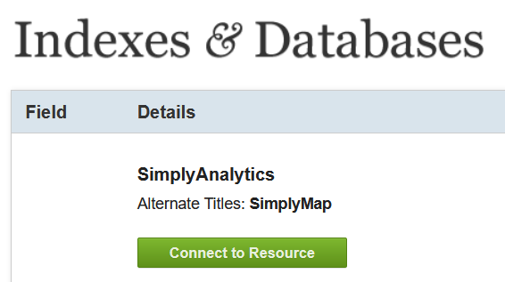

1. TOC
{:toc}

# Download the Data

## Login to Simply Analytics

We're gong to download some population estimates for 2021 using [Simply Analytics](https://resources.library.ubc.ca/page.php?id=1044).  You accesss to this resrouce via the UBC library, so you can also find it by Googlling "Simply Analytics UBC".  It should be one of the first results.  On the library page, click "Connect to the Resource".  This will redirect you to the simply analytics logon page.  Click the link to create a new account.

## Querrying the Database

Download the data folliwing the video instructions below:

<iframe width="560" height="315" src="https://www.youtube.com/embed/eEtLTafGxbM" title="YouTube video player" frameborder="0" allow="accelerometer; autoplay; clipboard-write; encrypted-media; gyroscope; picture-in-picture" allowfullscreen></iframe>

### QA

Simply Anayticis allows you to download data about bussinesses locations. [T/F]

### WA

Do you think this bussiness locations (restaurants, groceries) might be helpful when thinking about the cost of food?

## Import the Data

Check your eamil for the downlaod link.  Extract the Simply Analytics shapefile to the Module4/Current_Year_Estimate folder.

# Pre-Processing

Typically, we have to do a few things to our data to get everything setup and ready to go.  Get your data ready to work with following the video instructions bellow:

<iframe width="560" height="315" src="https://www.youtube.com/embed/YRm8Bv958gw" title="YouTube video player" frameborder="0" allow="accelerometer; autoplay; clipboard-write; encrypted-media; gyroscope; picture-in-picture" allowfullscreen></iframe>

### QA

We used the clip tool to ensure 

### WA 

Which projection did did choose for the Module 4 project?  Why did I choose this projection?

