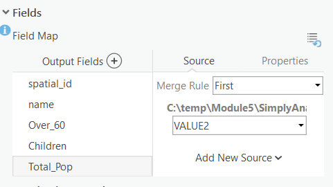

# Acquire Data
{: .no_toc }

  

    Table of contents
  

  {: .text-delta }
1. TOC
{:toc}

# Project Folder

I've gotten the ball rolling for you and setup a project.  Download the [Module5 folder here](https://github.com/June-Skeeter/Module5_GEOS270/blob/main/data/Module5.zip).  This project contains two layers: a DEM for the Port Alberni area and a vector layer representing the coastline.  It also contains a model that you can use identify areas at risk for Tsunami inundation.  Your task will be to incorporate data from the City of Port Alberni, the Province of British Columbia, and Statistics Canada.

# Port Alberni Data

Download the [PA_Data.zip](https://github.com/June-Skeeter/Module5_GEOS270/blob/main/data/PA_Data.zip) and extract it to your Module5 folder.  This folder contains Properties.shp (properties in the city by zoning type) which you should import into the PA_Risk_Assessment_Inputs feature dataset.  This folder also contains two text files:  ZoningCodes is metadata for Properties.shp.  We don't need to worry about it for now.  Shelters.csv is a text file with the Lat/Lon coordinates of the tsunami shelters.  See the video below for instructions on how to import point data from text files so you can import the Shelters layer into the PA_Risk_Assessment_Inputs feature dataset.

<iframe width="560" height="315" src="https://www.youtube.com/embed/KTZ5ix_O8Wo" title="YouTube video player" frameborder="0" allow="accelerometer; autoplay; clipboard-write; encrypted-media; gyroscope; picture-in-picture" allowfullscreen></iframe>

### QA2

Why do we use a feature dataset to hold all our input layers?

A) No reason
B) So everything is neatly grouped in one folder
C) To ensure all our vector data is in the same projection, the feature dataset will automatically re-project our vector data when importing
D) To ensure all our vector and raster data is in the same projection, the feature dataset will automatically re-project our vector and raster data when importing

<!-- C -->

# Downloading Census Data

We want to to download Dissemination Area level population data for the Port Alberni using [Simply Analytics](https://resources.library.ubc.ca/page.php?id=1044).  We are going to download three population variables:

* Total Population
* Total Households

The video below can help guide you through the download process. 

<iframe width="560" height="315" src="https://www.youtube.com/embed/Pe6xiF22kRs" title="YouTube video player" frameborder="0" allow="accelerometer; autoplay; clipboard-write; encrypted-media; gyroscope; picture-in-picture" allowfullscreen></iframe>

Once you have downloaded the data, extract it to your Module5 folder.  Import the Simply Analyticis shapefile into the PA_Risk_Assessment_Inputs feature dataset.  Name it Population_Data and **make sure** to set the field names following the same procedure as in Module4, reference the variables_names.txt file for the list of variable names.  I've given them the following names:

# Downloading Roads Data from DataBC

To conduct the analysis, we’ll also need a roads layer.  This data set is available for download from [DataBC](https://www.data.gov.bc.ca/).  Follow the video instructions to download the roads layers.

<iframe width="560" height="315" src="https://www.youtube.com/embed/5jaULGb5ux4" title="YouTube video player" frameborder="0" allow="accelerometer; autoplay; clipboard-write; encrypted-media; gyroscope; picture-in-picture" allowfullscreen></iframe>

You will be emailed a link to download the data.  Extract the file to your Modlue5 project then import the PA_Data folder in your PA_RiskAssesment project.  Name it PA_Roads.

