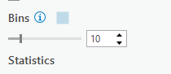

# Data Exploration

## Symbolize Census Data & Plot Relationships
These data layers have three variables: Population (total residents), Housing (monthly rent), and Income (annual total).  The Canadian Census collects many different variables.  We'll discuss the census more in depth during lecture.

**1**{: .label .label-red } Symbolize your census data by population.
* Change the symbology for Van_DA_2016 to Graduated Colors.
* Set the Field to Population.
* Leave everything else as is for now.  We'll discuss data classification methods in more detail later in term.

**2**{: .label .label-red } Create a chart income vs. housing.
* Right click Van_DA_2016 and click Create Chart > Scatter Plot.
* In the chart properties tab that opens, set Income as the X-axis and Housing as the Y-axis.
* Checking "Show linear trend" will display a regression line on your chart.

  <iframe src="content/videos/Symbolize.mp4" title="Processes" scrolling="no" frameborder="0"
    style="border: 0;
   height: 100%;
   left: 0;
   position: absolute;
   top: 0;
   width: 100%;">
   
Your browser does not support iframes.

 </iframe>

<a href="content/videos/Symbolize.mp4" target="_blank">View Image in New Tab</a>

## A Note on Linear Regression.
* A regression line is also know as a "line of best fit".  [Linear regression](https://en.wikipedia.org/wiki/Linear_regression#Introduction) assumes the relationship between an X variable (eg. Income) and a Y variable (eg. Housing) follows a linear relationship (eg. Y=MX + B) where M is the slope and B is the intercept. 
  * Linear regression assumes any deviations from that relationship are "random noise."
  * The "noise" is actually all the other unexplained variability.  Some might be "random", but rental cost is impacted by many factors (eg. scarcity) that aren't as easy to capture with census data alone.
* In the example below for Van_DA_2016, M = 0.0123 and b = 660.1, which means at $0 income, rent is $660.1.  And for every $100 increase in income, rent goes up $1.23.
  * The "R2" statistic, also known as the [coefficient of determination](https://en.wikipedia.org/wiki/Coefficient_of_determination) is a measure of how well a model fits the data.  It ranges from 0 to 1, with 0 representing "no fit" and 1 representing a "perfect fit".
  * The "R2" score here 0.066, meaning rental cost is not strongly related to income.  

### Table 1
Coeficinet of Detrmination values and the strength of the relationships they represent.

|R2| Relationship|
|-------------|-------------|
|<0.3         | Very Weak   |
|0.3 - 0.5    | Weak        |
|0.5 - 0.7    | Moderate    |
|>0.7          | Strong      |

## Comparing CTs to DAs
**3**{: .label .label-red } Follow the same steps as above to symbolize population and plot Income vs. Housing for the VanCMA_CT_2016 layer.  
* We'll cover the [census units](https://en.wikipedia.org/wiki/Census_geographic_units_of_Canada) in more depth during lecture.  In short Census Dissemination Areas (DAs) are the smallest census division used by the Canadian Census.  They cover the whole country and are generally grouped by municipality (eg. Vancouver) in to Census Subdivisions.  Census Tracts are larger units that are used to divide Census Metropolitan Areas (urban areas with populations > 100,000).

### **WA2**
What are the differences you notice between the CTs and DAs in terms of size and population?

### **QA1**
For every $100 increase in income at the CT level, how much does rental price increase?

### **QA2**
What is the r2 score for this model?

### **QA3**
Which Census Unit displays a more direct relationship between income and housing?
- DA
- CT
- About the same

## Check the NDVI Histogram
To get a feel for the distribution of NDVI values in the dataset, we're going to plot them in a histogram to aid our visual inspection of the NDVI data.

**4**{: .label .label-red } Create a chart showing the count of cells by NDVI values.
* Right click the projected NDIV layer and click Create Chart > Histogram
* Under Variable, set Band_1 as Number.  Note what shows up on the chart.
* A histogram represents a distribution by grouping the data into bins (ranges), and plotting the count of values (eg. raster cells) for by bin.
  * Change the bin number to see how changing the size of the bins, impacts how you perceive the data.  Try 10, then try 50.

**5**{: .label .label-red } Change the base map to help inspect the NDVI data.
* On the Map tab click Basemap and choose Imagery
* Toggle the NDVI Layer on and off to see how the NDVI values correspond to green vegetation on the visible imagery base map layer.
* Look at the histogram and compare the NDVI layer with the satellite image base map.

  <iframe src="content/videos/Histogram.mp4" title="Processes" scrolling="no" frameborder="0"
    style="border: 0;
   height: 100%;
   left: 0;
   position: absolute;
   top: 0;
   width: 100%;">
   
Your browser does not support iframes.

 </iframe>

<a href="content/videos/Histogram.mp4" target="_blank">View Image in New Tab</a>

## Classify the NDVI Image
Looking at the NDVI Layer, the satellite imagery basemap, and the histogram, we can make some inferences about the data.  The NDVI values have a bimodal distribution (two peaks) according to the histogram.  The peaks correspond to large swaths of land dominated by water and dense urban areas (low values) and dense green vegetation (high values).  Values in-between the peaks represent less dense urban areas, with increasing greenery.  We can classify (group) the NDVI into three classes (Green Vegetation, Medium Density Residential, Water/Urban).  

**6**{: .label .label-red } Use the natural breaks to estimate the class boundaries.
* Search for the Reclassify tool in the geoprocessing pane.  Use the projected NDVI layer as the input.
* Click classify to set the classification scheme.  Set the method to Natural Breaks, and the number of classes to 3.
<!-- * **If** you encounter an error/issue that mentions licensing, see the second video below for help. -->

  <iframe src="content/videos/Classify.mp4" title="Processes" scrolling="no" frameborder="0"
    style="border: 0;
   height: 100%;
   left: 0;
   position: absolute;
   top: 0;
   width: 100%;">
   
Your browser does not support iframes.

 </iframe>

<a href="content/videos/Classify.mp4" target="_blank">View Image in New Tab</a>

### **Q4**
Which value denotes the lower bound of the "Green Vegetation Class?"
