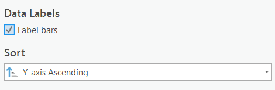

# Geospatial Analysis
{: .no_toc }

  

    Table of contents
  

  {: .text-delta }
1. TOC
{:toc}

# Automating with Model Builder

We’re going to use a tool called Model Builder to organize and save all of our analysis steps in one place.  When we use model builder, if any of our inputs or parameters change, a model can be easily adjusted and rerun at any time.  It also allows us to visualize our analysis process.  This is useful both for editing our own work and sharing it with others.  For a more detailed explanation of Model Builder, check out [this link](https://pro.arcgis.com/en/pro-app/latest/help/analysis/geoprocessing/modelbuilder/modelbuilder-quick-tour.htm).

### QA
Why are we using model builder for this analysis?

<!-- 1) Repeatable 2) changeable 3) Visualize process 4) share workflow -->

# Identify the Inundation Zone

Our criteria for land areas at risk for flooding are: land at or below 10 m elevation and within 1km of the coastline.  I have crated a model to do this part for you (see video below).  In order to identify the land areas in Port Alberni at risk for inundation, we need to do four tasks:

**1**{: .label .label-red } Reclassify the PA_DEM to identify all the areas under 10m elevation. See this link for info on the [Reclassify tool](https://pro.arcgis.com/en/pro-app/latest/tool-reference/spatial-analyst/reclassify.htm).

**2**{: .label .label-red } Convert the reclassified DEM to a polygon. See this link for info on the [Raster to Polygon Tool](https://pro.arcgis.com/en/pro-app/latest/tool-reference/conversion/raster-to-polygon.htm).

**3**{: .label .label-red } Buffer the waterbodies by 1km. See this link for info on the [buffer tool](https://pro.arcgis.com/en/pro-app/latest/tool-reference/analysis/buffer.htm)

**4**{: .label .label-red } Clip the coastline buffer with the inundation zone. See this link for an explanation of the [Clip tool](https://pro.arcgis.com/en/pro-app/latest/tool-reference/analysis/clip.htm).

## Using a Model

I have set up a model to handle the above tasks for you.  Watch the video below for an overview of the model.  Then open/edit the model yourself. To do this, right click the InundationZone model and click "Edit".   Then change the break values in the Reclassify to from 5 to 10 and run the model.  

<iframe width="560" height="315" src="https://www.youtube.com/embed/evyXxnqUKbg" title="YouTube video player" frameborder="0" allow="accelerometer; autoplay; clipboard-write; encrypted-media; gyroscope; picture-in-picture" allowfullscreen></iframe>

### QA

What is the shape area of the Inundation_Zone?

# Create Your Own Model

We need to figure out:

**1**{: .label .label-red } Which roads are at risk of flooding or damage?
**2**{: .label .label-red } Which properties in the city are at risk?
**3**{: .label .label-red } How many people within Port Alberni and the surrounding area are potentially living in areas at risk?
**4**{: .label .label-red } Are the Tsunami Shelters sufficient?

## Clip the Roads Layer

To answer **1**{: .label .label-red } all we need to do is clip the roads by the inundation zone.  Follow the video below to create a new model and clip the roads layer.  Name the output PA_Roads_Flood.

<iframe width="560" height="315" src="https://www.youtube.com/embed/F_AslIjacNI" title="YouTube video player" frameborder="0" allow="accelerometer; autoplay; clipboard-write; encrypted-media; gyroscope; picture-in-picture" allowfullscreen></iframe>

### QA

How many **km** of roads are at risk?  Rounded to the nearest tenth km is fine.  *Hint* Open the attribute, of PA_Roads_Flood, click right Click Shape_Length >> Statistics to find the sum.

<!-- 49.6 km -->

## Select Properties by Location

To answer **2**{: .label .labe-red} we can use select by location.  See the video below for an explanation of the select by location and instructions on how to apply it in your model.  Name the result Properties_at_Risk.

<iframe width="560" height="315" src="https://www.youtube.com/embed/vqHmErK5J-g" title="YouTube video player" frameborder="0" allow="accelerometer; autoplay; clipboard-write; encrypted-media; gyroscope; picture-in-picture" allowfullscreen></iframe>

Create a bar chart of properties by ZoneName.  *Hint* If you check label bars, and sort by the y-axis, it can make your chart easier to interpret.

### QA

How many residential properties are are at risk?  

### QA

How many multi-family residential properties are are at risk?  

<!-- 49.6 km -->

## Select Properties by ZoneName and Intersect Population Data

To answer **3**{: .label .labe-red}, the process is a bit more complicated.  If we simply clip the DAs by the Inundation Zone, we'll end up with a significant overestimate.  Its best to overestimate when doing hazards analysis if you can't avoid it, but we need our results to be realistic.  We will use three steps to estimate the *maximum* number of people who may be displaced.  

**A**{: .label .labe-red} Select just residential and multi-family residential properties.

**B**{: .label .labe-red} Intersect Population_Data with the Selection.

**C**{: .label .labe-red} Dissolve the Intersection.

### QA

What is our estimate of Pop_at_Risk?

<!-- 1444 -->

## Select Shelters by Location

To answer **4**{: .label .labe-red}, we can use select by location again.  A shelter is only viable if its more than 150 meters away from the inundation zone.  Follow the video below to get setup.

### QA

Are all the shelters in acceptable locations?