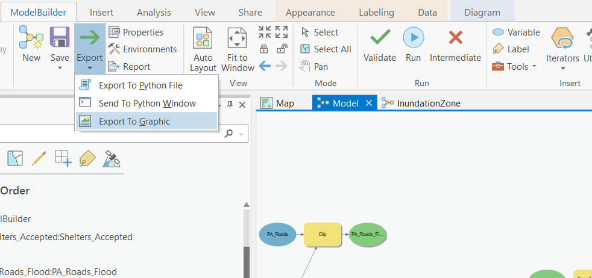

# Visualizatons & Reports
{: .no_toc }

  

    Table of contents
  

  {: .text-delta }
1. TOC
{:toc}

# Export Your Model

In your model window, hit Auto Layout one more time.  Then click export and save your model as PA_RiskAssesment.pdf  *Note* Make sure you save your output as a .pdf, not a .svg file!

### FA1

Upload your model to canvas.

# Supporting Figures

Create two bar charts.  One showing the total count of properties at risk by ZoneName.  Another showing the population at risk (Pop_at_Risk) by Dissemination Area (spatial_id).

### FA2

Upload your Charts to canvas.

# Map the Assessment

Create a map showing the the Inundation Zone, roads at risk of flooding, properties at risk, and approved shelter locations.  Use the Symbology to emphasize the Arterial Roads, distinguish between residential and non-residential properties that are at risk, and show the shelter locations with graduated symbols.  The video below gives you some tips.  **Note** Make sure to take into consideration the [Data Visualization](https://june-skeeter.github.io/Module4_GEOS270/docs/Content_Part1.html) tips presented in Module 4 when creating your maps

<iframe width="560" height="315" src="https://www.youtube.com/embed/0TnQAzxwWaQ" title="YouTube video player" frameborder="0" allow="accelerometer; autoplay; clipboard-write; encrypted-media; gyroscope; picture-in-picture" allowfullscreen></iframe>

### FA3

Upload your Map to canvas.

# Report on Your Results

### WA3

Write a brief (1 page) report for the City of Port Alberin.  The report needs explicity answer the four questions questions:

**1**{: .label .label-red } Which roads are at risk of flooding or damage?

**2**{: .label .label-red } Which properties in the city are at risk?

**3**{: .label .label-red } How many people within Port Alberni and the surrounding area are potentially living in areas at risk?

**4**{: .label .label-red } Are the Tsunami Shelters sufficient?

You should briefly summarize the analysis steps you used to conduct the Tsunami Risk Assessment and explain your findings referring to your charts, map, statistics where necessary.

<!-- Needs to explain results & answer each question (see above^) (10 pts - 2 each) + introduction/summary of problem (5pts) + explain steps (5pts)-->