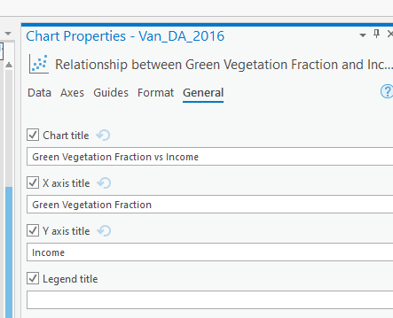

# Data Visualization

## Insert a Layout
Add a layout to your map.  Choose the 8.5":" x 11" Letter size, in the Landscape orientation.

## Adding a Chart to the Layout
Arc allows you to add charts to your layout in addition to maps.

  <iframe src="content/videos/Layout.mp4" title="Processes" scrolling="no" frameborder="0"
    style="border: 0;
   height: 100%;
   left: 0;
   position: absolute;
   top: 0;
   width: 100%;">
   
Your browser does not support iframes.

 </iframe>

<a href="content/videos/Layout.mp4" target="_blank">View Image in New Tab</a>

## Change the Chart Title
In the chart properties pane, under general, you can change the title of the chart so it is more concise and fits on the layout better.

## Resize Items and Set Map Scale
Resize the map and chart so the map is a bit bigger than the chart.  Then set the map scale to 1:100,000 and add the scale to the map.

## Add Other Map Elements
Add all the appropriate map elements: Title, Legend, North Arrow, and Source Statement.  You can reference previous Modules for a refresher on how to do this.
* For the Data Source in you Name/Source Statement, list Stats Canada and Google Earth Engine as the data sources
* Your final map should look something like shown below.
  * The chart should show the relationship between green vegetation area and income.  The map should show mean NDVI value by DA.
  * This map is just a rough guide, feel free to make your own stylistic choices to improve on it.

  <iframe src="content/images/FinalMap.png" title="Processes" scrolling="no" frameborder="0"
    style="border: 0;
   height: 100%;
   left: 0;
   position: absolute;
   top: 0;
   width: 100%;">
   
Your browser does not support iframes.

 </iframe>

<a href="content/images/FinalMap.png" target="_blank">View Image in New Tab</a>

### FA1
Export your Layout as a .pdf and upload it to Canvas.

### WA4
What do the results of this analysis show?  Are there any improvement you think we could make to this analysis?

<!-- The relationship isn't strong, probably because there are other factors that are determine where people with limited resources can afford to live and where those with money choose to live. (7.5 pts)

Things to look at might include: housing cost (rent or land value) instead of income.  Both NDVI & green area combined (eg. multivariate linear regression). Excluding downtown core and focus on just medium density residential areas.  Account for water/beaches (also attracts high income but low NDIV)  .  These are just possible suggestions, they don't have to list these anything that makes sense counts (7.5 pts for listing two or more suggestions, 3.25 pts if just one). -->

