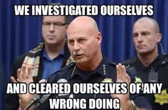
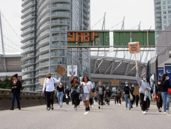
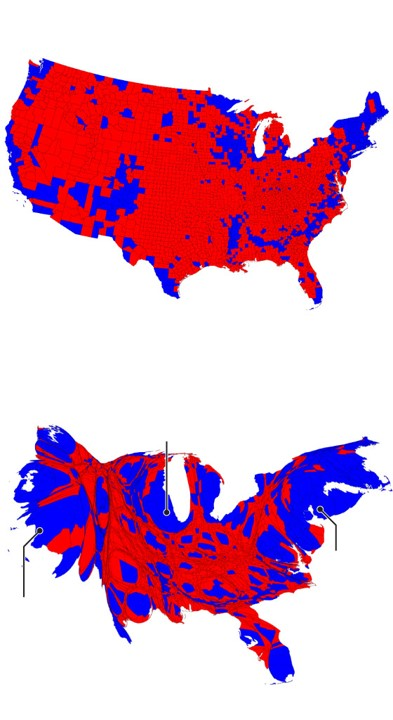

# Ethics in GIS
{: .no_toc }

GIS, more than many disciplines has immense potential to have an impact on peoples lives.

  

    Table of contents
  

  {: .text-delta }
1. TOC
{:toc}

# What is Ethics?

Ethics is a branch of philosophy that deals with the nature of right and wrong.  It is a theory or set of standards that inform moral practice.  Though the laws we have constructed as a society may be informed by morality, Ethics and legality are **not** synonymous.

Legal but Unethical                   | Ethical but Illegal              
:------------------------------------:|:-------------------------------------:
 |

---

## Ethics in Science

Research often involves handling the private, personal information about individuals and minority groups:
* Potential participants must be able to trust that their information will be used in a safe and respected manner.
* In some fields, ethics boards often review research proposals to ensure best practices are used.
  * How will the data be used?
  * Who will have access to data/results?
  * What identifying information will be used/released?

### Ethics in GIS
{: .no_toc }

GIS has the potential to be **more** intrusive in to people’s every day lives other sciences:
* We can know where people are at any given time
* We can guess at what they are doing reasonably well
* We can know where people shop, approximately how much money they make, who they know, and to which organizations they belong
* We can know if they belong to minority groups:
  * E.g., racial minorities, religious minorities, political groups, LGBTQI* 

### The Power of a Line
{: .no_toc }

What side of a border you live up on can have drastic impacts on outcomes.  Where you live determines:

- What rights you have.
- What schools you attend.
- How much your vote matters (if you even get to vote).
- How much you pay in taxes.
- What services you have access too.
- Where you can travel.

---

## Data privacy and security

Point locations risk exposing personal information.  Many agencies have guidelines surrounding exposure of health information.  More detailed information gives more accurate representations and allows for better decision making.  But it also impacts privacy  Where is they line?  How specific is too specific?  The city of Toronto maps COVID cases at the [neighborhood level](https://www.toronto.ca/home/covid-19/covid-19-pandemic-data/covid-19-neighbourhood-maps-data/), in BC data is released at a much [coarser resolution](http://www.bccdc.ca/Health-Info-Site/PublishingImages/health-info/diseases-conditions/covid-19/data/covid19_lha_20211114_20211120.png) and the interactive data portal gives [less information](https://experience.arcgis.com/experience/a6f23959a8b14bfa989e3cda29297ded).

## Data representation

All maps lie, but some lie more than others.  How we choose to display our data can have a big impact on how it is perceived.  Every cartographic choice you make can have ramifications.

**Sometimes the choices are intentional**

**Sometimes they are careless oversights**

**Sometimes the lack of context is the issue**

# Who Has Access to GIS? 

Who has access to GIS?  ESRI products (e.g. ArcGIS Pro) have very expensive licensing fees.  Beyond just the cost of the software, hardware to run GIS is not always accessible, and GIS training takes time.  There are options to make GIS more accessible to the public, but regardless, GIS

## Open Source Options
{: .no_toc }

There are open source alternatives that can provide some access to GIS:

* [QGIS](https://qgis.org/en/site/) is an application with similar functionality to ArcGIS Pro.
* Python, R, JavaScript etc. are open source programming languages that have many GIS packages.
* Free help pages like [stackexchange](https://gis.stackexchange.com/) and github doc's pages (eg. [qgis](https://github.com/qgis/QGIS)) can help with training, but they require a base level of knowledge first.

# Positionality

It is important to reflect on your relation to your work.  In the social sciences, positionality is especially important, because a researches privileges, biases, and preconceptions can drastically impact the people and communities they are working with.  In some of the "hard" sciences, there are often a claims of total objectivity, but complete objectivity is impossible.  No one is completely objective, that must be understood and acknowledged regardless of the field.

## Why this topic? Why now? Why me?
{: .no_toc }

Some important questions to ask yourself.  You should disclose this information when pertinent.

* Who am I and where do I come from? 

* What is my relationship to the community/field I am working in? 

* What are my motivations for this work?
  * What biases may I have and how may my past experiences influence how I engage with this work?

---

# Public Participation in GIS

There are many ways the public can be involved in GIS; the can participate actively or passively.  Engagement is crucial in many ways.

## Volunteer Geographic Information

The collection, processing, assembly, and dissemination of geographic data provided voluntarily by individuals.  Is sometimes, part of participatory approaches to GIS; sometimes its just using freely provided information that people are unaware of.  This is equally likely to be used for commercial purposes as it is for participatory, educational, and other non-commercial uses: E.g. Trip Advisor, Flickr, Twitter, etc.  Usually some sort of "wisdom of the crowds" is used to validate data, or else data verification and validation is performed by the organizing group

## Citizen Science

Allows interested volunteers and researchers to team up to address some scientific question.  Volunteers provide the “leg work” of data collection, data cleaning, and initial interpretation of field data.  Guided by scientific research experts.  Participation levels can range from simple data collection through to contributing to academic journal submission.  

  <iframe src="https://maps.cocorahs.org/" title="Processes" scrolling="no" frameborder="0"
    style="border: 0;
   height: 100%;
   left: 0;
   position: absolute;
   top: 0;
   width: 100%;">
   
Your browser does not support iframes.

 </iframe>

<a href="https://maps.cocorahs.org/" target="_blank">View in New Tab</a>

## Participatory GIS

The primary goals of PGIS are the empowerment and inclusion of marginalized people.  These groups tend to have little or no voice in the public arena due to extremes of location, poverty, racism, sexism, anti-religious feelings, or political disempowerment.  Often begins through a process of community mapping, with many steps and a set of long-term goals for the community.

* Have members of the community generate their own data and construct their own maps
* Bring members together to share their maps
* Combine their work into a single community map and open the map up to review by the broader public
* These community efforts can then be coded into a GIS to systematize the community’s knowledge and allow for greater spatial analysis to occur

### Inuit land use and occupancy project
{: .no_toc }

Participatory/counter mapping to safeguard Inuit rights to Arctic lands and waters.  Inuit People became increasingly concerned about resource extraction projects.  Commissioned a study on land use and occupancy that was instrumental in the establishment of Nunavut.

No references to published work or other secondary sources of information: 100 % Original Data collection from Inuit Sources

