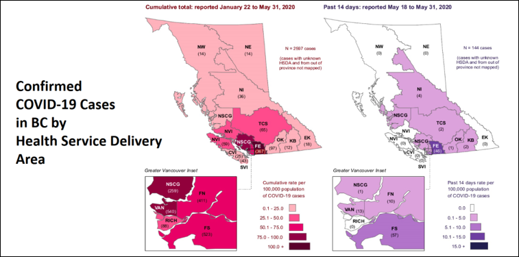
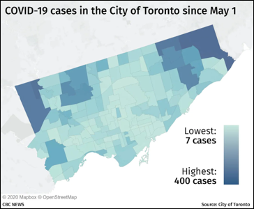

# Ethics
{: .no_toc }

GIS, more than many disciplines has immense potential to have an impact on peoples lives.

  

    Table of contents
  

  {: .text-delta }
1. TOC
{:toc}

# Unchecked Potential

Many machine learning systems are becoming more complex than we can fully comprehend.  Artificial Intelligence (AI) has the capacity to be of significant benefit to humanity - learning complex patterns and predicting outcomes before traditional systems can.  However, they can also do significant harm when used irresponsibly and without proper oversight.

## Are We Automating Racism?

This video by Vox gives a pretty good overview of some of the problems with AI and discusses some possible solutions.  

<iframe width="560" height="315" src="https://www.youtube.com/embed/Ok5sKLXqynQ" title="YouTube video player" frameborder="0" allow="accelerometer; autoplay; clipboard-write; encrypted-media; gyroscope; picture-in-picture" allowfullscreen></iframe>

### WC2

Use the information presented in the [Vox video](https://www.youtube.com/embed/Ok5sKLXqynQ) to write a paragraph or two discussing how racial bias has permeated our tech systems and some of the things that need to be done to counter these issues.

# The Power of a Line

What side of a border you grow up on can have drastic impacts on outcomes.  Where you live determines:

- What rights you have.
- What schools you attend.
- How much your vote matters (if you even get to vote).
- How much you pay in taxes.
- What services you have access too.
- Where you can travel.

# Who Has Access to GIS? 

Who has access to GIS?  ESRI products (e.g. ArcGIS Pro) have very expensive licensing fees.  Beyond just the cost of the software, hardware to run GIS is not always accessible, and GIS training takes time.  There are options to make GIS more accessible to the public, but regardless, GIS

## Open Source Options

There are open source alternatives that can provide some access to GIS:

* [QGIS](https://qgis.org/en/site/) is an application with similar functionality to ArcGIS Pro.
* Python, R, JavaScript etc. are open source programming languages that have many GIS packages.
* Free help pages like [stackexchange](https://gis.stackexchange.com/) and github doc's pages (eg. [qgis](https://github.com/qgis/QGIS)) can help with training, but they require a base level of knowledge first.

# What is Ethics?

Ethics is a branch of philosophy that deals with the nature of right and wrong.  It is a theory or set of standards that inform moral practice.

## Ethics in Science

Research often involves handling the private, personal information about individuals and minority groups:
* There is a need that potential participants trust that their information will be used in a safe and respected manner

### Ethics in GIS

In many ways, GIS has the potential to be more intrusive in to people’s every day lives other sciences:
* We can know where people are at any given time
* We can guess at what they are doing reasonably well
* We can know where people shop, approximately how much money they make, who they know, and to which organizations they belong
* We can know if they belong to minority groups:
  * E.g., racial minorities, religious minorities, political groups, LGBTQI* 

## Data privacy and security

Point locations risk exposing personal information.  Many agencies have guidelines surrounding exposure of health information.  More detailed information gives more accurate representations and allows for better decision making.  But it also impacts privacy  Where is they line?  How specific is too specific?

## Data representation

All maps lie, but some lie more than others.  How we choose to classify our data can have a big impact on how it is perceived.  Every cartographic choice you make can have ramifications.

# Positionality

It is important to reflect on your relation to your work.  In the social sciences, positionality is especially important, because a researches privileges, biases, and preconceptions can drastically impact the people and communities they are working with.  In some of the "hard" sciences, there are often a claims of total objectivity, but complete objectivity is impossible.  No one is completely objective, that must be understood and acknowledged regardless of the field.

## Why this topic? Why now? Why me?

Some important questions to ask yourself.  You should disclose this information when pertinent.

* Who am I and where do I come from? 

* What is my relationship to the community/field I am working in? 

* What are my motivations for this work?
  * What biases may I have and how may my past experiences influence how I engage with this work?

---

### QC2

____ is the practice of reflecting on and disclosing your position relative to your work/research. 

### QC3

Just because something is illegal, does not mean its unethical. [T/F]

### QC4

____ software can help minimize the barriers to access GIS technology.