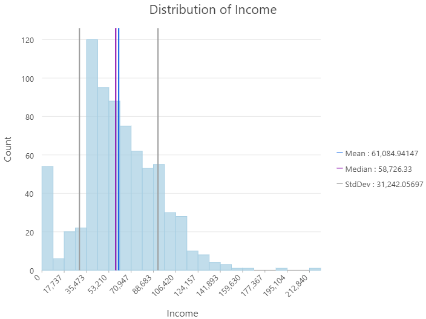

# Descriptive Statistics
{: .no_toc }
When classifying data, descriptive statistics can be used to inform the choice of classification.  They are also typically used *by* the classification methods.

  

    Table of contents
  

  {: .text-delta }
1. TOC
{:toc}

# Histograms

Order data and bin by intervals.  It is typically useful to inspect a histogram before classifying you data.

# Central Tendency

Measures of Central Tendency are useful for **Quantitative** data, they can also be calculated for **Ordinal** data, but must be interpreted with caution.

**Mode**: Most frequent value in a set  

**Median**: Middle value in a set (not impacted by outliers) - median income

**Mean**: Sum divided by count (impacted by outliers) - mean cost of food

# Dispersion

Measures of dispersion give context to measures of central tendency.

**Range**: Difference between maximum and minimum.  Gives measure of spread of data.

**Interquartile Range**: Difference between the 75th and 25th percentile value.

**Standard Deviation**: Measure of spread around the mean.

# Frequency Distribution

Frequency Distributions (Counts) Most useful for **categorical** data or **discrete** numeric data.

# Probability Distribution

Probabilities of occurrence of different possible outcomes based on the distribution of a dataset.  A common one we work with is the **Normal Distribution**.  The normal distribution (bell curve) is an idealized distribution, based on distance from the mean in *standard deviations*.  It can be helpful in outlier detection.  Outliers are values that are well outside the "normal" distribution of values.  Not all data can be fit to a normal distribution (eg. population counts).

