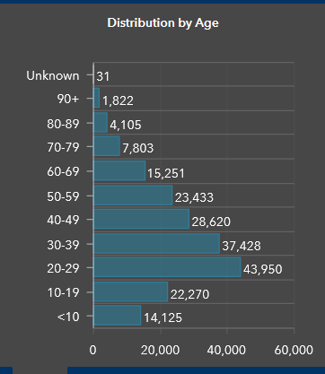
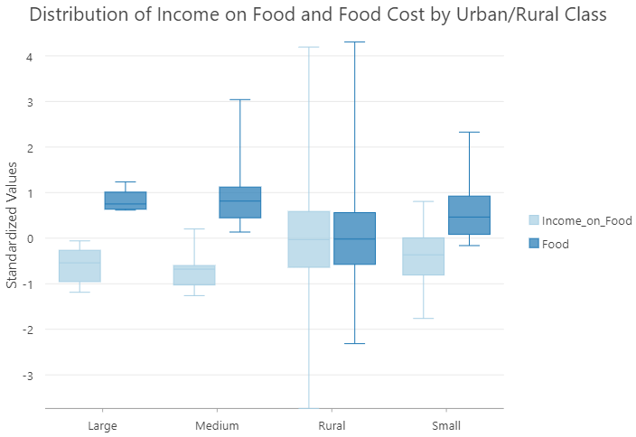

# Normalization
{: .no_toc }

  

    Table of contents
  

  {: .text-delta }
1. TOC
{:toc}

# Scaling

Normalizing allows us to scale a value by a unit of another - time, area, population etc.  These scaled values are more meaningful in the context of our analysis.

## COVID Case Rates
- Total COVID cases aren't useful if the units being compared have vastly different populations (eg. provinces/territories).  Time rates (rolling 7 day averages) can be more useful than daily values - Smooths out variability

* <a href="https://health-infobase.canada.ca/covid-19/epidemiological-summary-covid-19-cases.html?stat=num&measure=total_last14&map=pt#a2" target="_blank">Canada COVID Portal</a>

# Confounding Factors

Normalizing allows us to account for **confounding variables**.  These values can mask or hide patterns in our value of interest.  Confounding variables can:

* **Be highly correlated**, eg. income and food cost.

* **Exhibit no correlation**, eg. population and shape area.

## Multiple Confounding Factors

Multiple confounding variables.  For example: COVID rates by age groups- **1)** Population by age group, **2)** Workforce participation, & **3)** Occupational exposure.  It isn't always straightforward to include multiple values.

# Standardizing

Standardizing can also allow us to compare between **two or more** variables in different units!

