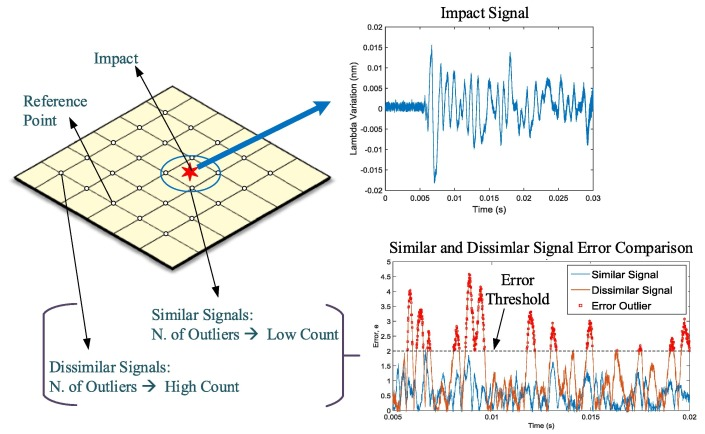

# Unsupervised Classification
{: .no_toc }

  

    Table of contents
  

  {: .text-delta }
1. TOC
{:toc}

**Data defined** methods: the user decides on the number of classes.  The rest is left of up to an algorithm.

# Common Examples in ArcGIS Pro

## **Equal Interval**
The simplest classification scheme, data is split to bins of equal width based on the range.

## **Defined Interval**
Basically the opposite of equal interval.  We define the bin width, the algorithm defines the number of bins.

## **Quantiles**
Slightly more complex classification scheme, data is split into bins by percentiles.  Eg. class 1 contains 0-20%, class 2 is 20-40%, class 3 is 40-60%, class 4 is 60-80%, & class 5 is 80-100%.

## **Natural Breaks**
Often more effective, data is split using the [Jenks algorithm](http://wiki.gis.com/wiki/index.php/Jenks_Natural_Breaks_Classification).  This algorithm optimizes the data split into "Natural" classes.  The algorithm maximizes within group similarity and between group dissimilarity.  

## **Standard Deviation**
This distribution-based classification method shows how far a value is from the mean in standard deviations.  It can be very informative to a knowledgeable user, but it is not accessible for the general public.  The standard deviation classification method converts the data to interval data (deviations above/below the mean).  [Diverging colormaps](https://colorbrewer2.org/#type=diverging&scheme=RdBu&n=5) are a better choice for interval data in many instances, as they can better highlight what values are above or below the zero point.

# More Complex Methods

There are many classification methods that are a bit too complex to actually perform in this course, but its important to be aware of them.

## K-means

Algorithm uses random steps to group data into clusters.

## Median Absolute Deviation

Used for automated detection of outliers.

