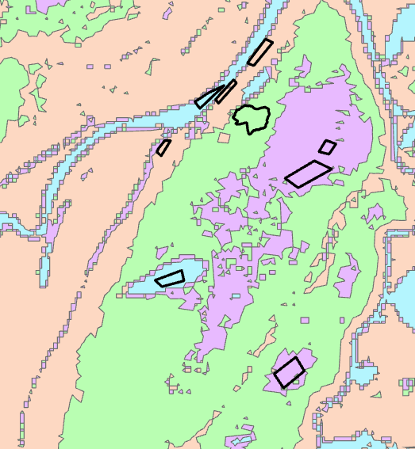

# Supervised Classification
{: .no_toc }

  

    Table of contents
  

  {: .text-delta }
1. TOC
{:toc}

**User defined** methods: The user explicit defines classes *or* provides set of classes as training data.

# Purely User Defined

## **Manual Breaks**

* We define our own break values to classify data.  This allows us to choose more meaningful break values if necessary (round numbers, clean fractions, etc).  It can also allow us to classify by multiple factors (eg. Stats Canada Urban v. Rural).  The choice of manual breaks can influence the way the data is perceived.

# More Complex Methods

We can define classes ourselves, then let a computer define the actual break values.  We won't apply any of these methods in lab, they're a bit complex for an intro GIS course.  However its important to be aware of them as they are becoming increasingly common in practice.  

## **Classification and Regression Trees**

Decision trees can fit training data to user defined categories, they can then be applied to new data to make predictions.

## **Random Forests**

Multiple trees can be averaged to increase performance and generalization

Decision trees and random forest allow us to apply classifications to complex multidimensional datasets.

## **Neural Networks**

Neural Networks, also know as Artificial Intelligence, are one of the most complex methods out there.  My thesis focuses on applying these methods to better understand [Carbon Emissions](https://bg.copernicus.org/articles/17/4421/2020/#section3)

