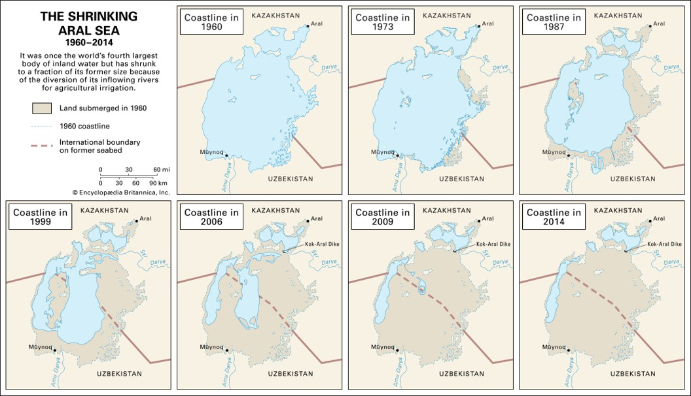

# Space and Time: Mapping Across Space **and** Time

Most of the things we want to know about in the world have three main components: **What**, **Where**, and **When**.

Nearly everything we are interested in studying in the natural and social sciences has some temporal element to it.  Most GIS data have both a spatial and temporal component to them.  Spatial data is “special” because of its natural tendencies (e.g., Tobler’s Law, autocorrelation, & natural clustering), similar processes also effect temporal data.

## Static vs. Dynamic

Phenomena that do not change over time are said to be **static**.  These features only need to be collected once and remain the same unless changed by an outside force.  Nothing in the universe is truly static, but on human timescales, things like mountains and continents be considered static.

Phenomena that change constantly over time are said to be **dynamic**.  These features must be captured often at a level commensurate with the temporal scale you are using.  Forest fires are extremely dynamic, changing on timescales of hours.  Other phenomena generally move more slowly, like the spread of an invasive plant species or changes in human populations.

### Series of Static Maps

These are just a small number of maps usually collected at regular intervals such as years or decades to show changes over time
Strengths:
Ideal for printed form
Work well with a small (3-6) number of “slices”
Weaknesses:
Not good for large number of slices (> 10)
May not clearly demonstrate subtle changes between slices over longer periods of time

### Animated Maps

In simplest form, just showing static maps one after another
Strengths:
Good for web resources
Can work well with short or medium time period focused on one area
Weaknesses:
Do not work in print
Does not work well for subtle changes over large geographic areas

### Dynamic Maps

Allowing users to zoom in or out to interact with the data.  **Strengths**: Ideal for web based applications.  Can incorporate many different data sources that can be turned on and off by the user.  **Weaknesses**: Do not work in print, requre an internet connection, can be difficult to use.

  <iframe src="content/PID.html" title="Processes" scrolling="no" frameborder="0"
    style="border: 0;
   height: 100%;
   left: 0;
   position: absolute;
   top: 0;
   width: 100%;">
   
Your browser does not support iframes.

 </iframe>

<a href="content/PID.html" target="_blank">View Map in New Tab</a>
