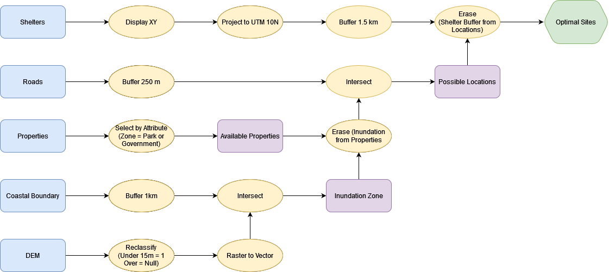

# Final Exam Review

## Essays (30 pts x3)

* No definitive word count/limit.  Responses can be brief, but should be thorough - answer all parts of the question.
  * Give examples!
  * Sketches/Illustrations can be incorporated (*not required*)
  * Type them up and submit as .pdf
    * **Make Sure it's a .pdf!**
    * Formats like .pages - are not readable across platforms

* You can expect:
  * 1 essay on spatial coordinate systems (Module 1)
    * **Randomly assigned** from bank
  * 1 essay on spatial data models (Module 2)
    * **Randomly assigned** from bank
  * 1 essay on other topics from the course
    * Given a choice from multiple prompts.
      * One of three possible topics:
        * Principals of map design
        * Uncertainty
        * History & Ethics

## Flowchart (50 pts x1)

* Tests your ability to work through a problem using GIS methods.  Create a flow chart outlining a GIS analysis in response to a prompt.

### Flowchart Practice Question

**Prompt**: Based on your analysis from the Tsunami Risk Assessment, the city of Port Alberni has been given funding build a new evacuation shelter.  You have been contracted by the city and tasked with finding a suitable location for the shelter.

**Criteria**: The shelter must

* Be located outside of any potential inundation zone (Elevation > 15 m **or** distance from coastline > 1 km).
* Be at least 1.5 km away from existing shelters.
* Located no more than 250 m away from an Arterial Roadway.
* Cannot be located on Residential, Commercial, or Industrial Parcels

**Data**

|Name      |      Type          |  Coordinate System  |  Attributes |
|----------|--------------------|---------------------|-------------|
|Digital Elevation Model |Raster|UTM Zone 10N | Elevation (m) |
|BC Coastal Boundary File|Vector (line) |UTM Zone 10N | Name |
|BC Roads Layer |Vector (line) |UTM Zone 10N | Road Type (Arterial, Residential, Private), Name |
|Properties |Vector (polygon) |UTM Zone 10N | Zoning Type (Residential, Commercial, Industrial, Parks, Government/ Institutional) |
|Current Shelters |Text (.csv)|WGS 1984 | Latitude/Longitude, Name, Capacity |

I suggest you use [diagrams.net](https://app.diagrams.net/) because its easy to create clean flowcharts quickly.  But you can do it however you'd like.
  * When exporting to submit, make sure to export/submit a .png, .jpg, or .pdf

## Short Answer Questions (10 pts x6)

Generally, 1-3 sentences will suffice.  Try not to write much more than a paragraph.  Bullet point lists are sufficient where applicable.

* Explain a key concept in your own words or give examples of a specific issue.

### Remaining Questions

* 5pts x5 **Fill in the blanks**

* 5pts x1 **Matching**

* 2pts x8 **Multiple Choice**

* 1pt x4 **True/False**

### Extra Credit

* Write a positionality statement for your final project.  (Point value tbd)

